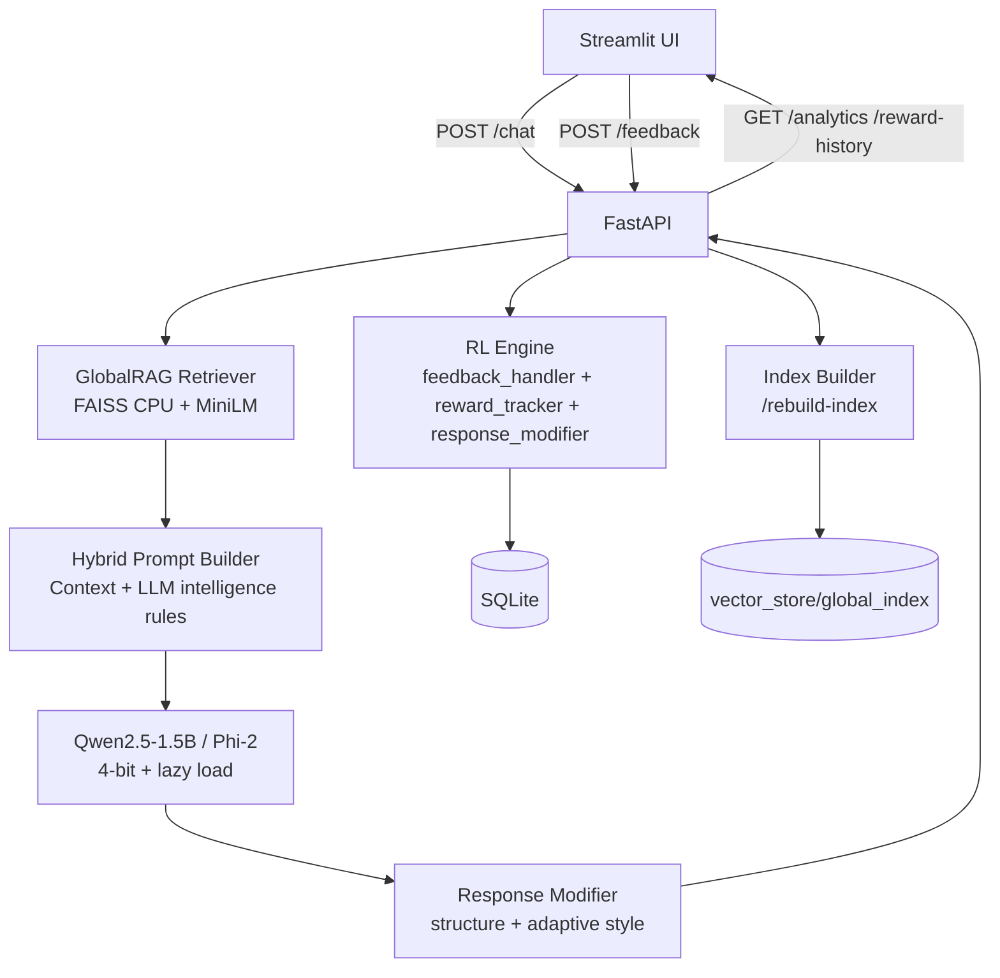

# Reinforcement-Aligned Academic Intelligence System

Hybrid academic tutor for B.Tech domains with unified PDF knowledge base, RAG + LLM verification, and adaptive reinforcement from user feedback.

## Supported Domains

- IT
- EEE
- ECE
- Cyber Security
- AIML
- Data Science
- Civil
- Mechanical
- CSE

## Architecture



## Core Pipeline

1. Scan PDFs recursively from `data/` (fallback to root subject folders if needed).
2. Build one global FAISS index (`vector_store/global_index`).
3. Retrieve top-5 chunks for each query.
4. Generate hybrid answer using retrieved context + pretrained LLM reasoning.
5. Enforce structured exam-oriented response format.
6. Log feedback and adapt future same-question responses when rewards are low.

## Required Response Format

Every answer is steered to include:

- ?? Short Summary
- ?? Detailed Explanation (core concept, definitions, components)
- ?? Real-world Example
- ?? Diagram explanation
- ?? Exam-Oriented Points
- ?? Key Advantages / Disadvantages
- ?? Conclusion

Target detail length: ~400-800 words (model permitting).

## RL Adaptation Logic

- Store feedback rating/reward in SQLite.
- Track reward history per normalized question (`query_key`).
- If low-rated pattern detected:
  - increase depth,
  - add additional example,
  - strengthen exam points,
  - enforce stronger structure.

## API Endpoints

- `POST /chat`
- `POST /feedback`
- `POST /rebuild-index`
- `GET /documents`
- `GET /analytics`
- `GET /reward-history`
- `GET /health`

## Run (Windows, CPU-only, 8GB RAM)

1. Create env and install:

```powershell
python -m venv .venv
.\.venv\Scripts\Activate.ps1
pip install -r requirements.txt
```

2. Configure env:

```powershell
copy .env.example .env
```

3. Build global index:

```powershell
python scripts/build_faiss.py
```

4. Run API:

```powershell
powershell -ExecutionPolicy Bypass -File scripts/run_api.ps1
```

5. Run UI:

```powershell
powershell -ExecutionPolicy Bypass -File scripts/run_ui.ps1
```

## Performance Defaults (Laptop Safe)

- 4-bit quantized model load attempt.
- CPU fallback mode if quantized backend unavailable.
- Embedding model: `all-MiniLM-L6-v2`.
- Max generation tokens: `700`.
- Indexing safety limits:
  - `MAX_PDF_SIZE_MB=30`
  - `MAX_PAGES_PER_PDF=40`

You can raise these limits after confirming stable performance on your machine.

## Fine-Tuning (Colab)

Use:
- `colab/lora_training_colab.py`

It trains LoRA adapters to follow structured academic explanation style and exports `lora_adapter.zip` for local inference merge.

## True RLHF (Policy Update, GPU/Colab)

Current backend does online reward-aware adaptation locally.  
For mathematically correct RL policy updates, use this pipeline:

1. Export RLHF dataset from collected feedback:

```powershell
python scripts/export_rlhf_dataset.py
```

Outputs:
- `data/rlhf/policy_gradient_train.jsonl`
- `data/rlhf/preference_pairs.jsonl`

2. In Colab, run:
- `colab/true_rlhf_policy_gradient_colab.py`

This script:
- trains a reward model from ratings,
- performs reward-driven policy parameter updates (LoRA adapter),
- exports `rlhf_lora_adapter.zip`.

3. Use updated adapter locally:
- unzip into `adapters/lora_adapter`
- restart API (`scripts/run_api.ps1`)

Your local model loader will merge adapter automatically when present.
